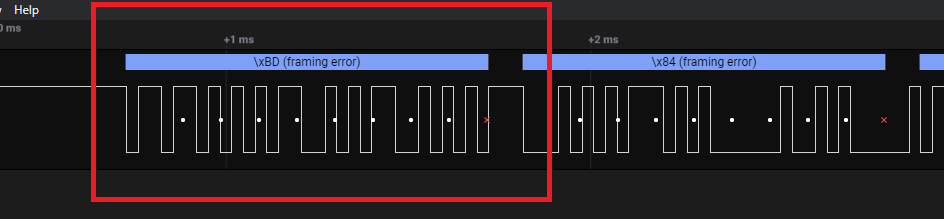
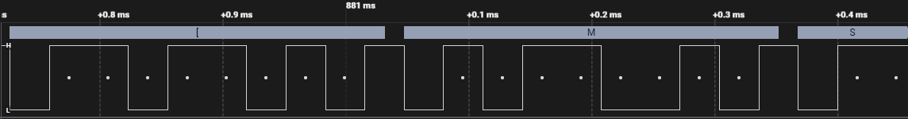

The first thing I did was to unzip the .sal file and looking into it I found out it was a salean file so let download the application to analyze the file properly

Once you have loaded into the file and set up the analyzer with the default value bitrate of *9600* you will will notice framing error, the problem here is that the bit rate is too low.

Notices the white dots that where the system measure the current state of the system, you will quickly see that there are data between the measurements 

So we have to edit the bit rate.
Looking at the shortest interval we see that 

$\test{Bit rate (bit/s)}=\frac{1 second}{(32.02 x 10^{-6})} \test{seconds} = 31230.480949406621 = 31230$

- The $10^{-6}$ is to convert milliseconds to seconds

Notices how the dots aligns much better now, we are now able to retrieve the flag.

Notices the footer of the frame of two bits a *1* and *0*.

name	type	start_time	duration	data
Async Serial	data	1.24976392	0.00030418	H
Async Serial	data	1.25008426	0.00030418	T
Async Serial	data	1.2504046	0.00030418	B
Async Serial	data	1.25072496	0.00030418	{
Async Serial	data	1.2510453	0.00030418	d
Async Serial	data	1.25136564	0.00030418	3
Async Serial	data	1.25168598	0.00030418	8
Async Serial	data	1.25200632	0.00030418	u
Async Serial	data	1.25232668	0.00030418	9
Async Serial	data	1.25264702	0.00030418	9
Async Serial	data	1.25296736	0.00030418	1
Async Serial	data	1.2532877	0.00030418	n
Async Serial	data	1.25360806	0.00030418	9
Async Serial	data	1.2539284	0.00030418	_
Async Serial	data	1.25424874	0.00030418	1
Async Serial	data	1.25456908	0.00030418	n
Async Serial	data	1.25488944	0.00030418	7
Async Serial	data	1.25520978	0.00030418	3
Async Serial	data	1.25553012	0.00030418	2
Async Serial	data	1.25585046	0.00030418	f
Async Serial	data	1.25617082	0.00030418	4
Async Serial	data	1.25649116	0.00030418	c
Async Serial	data	1.2568115	0.00030418	3
Async Serial	data	1.25713184	0.00030418	5
Async Serial	data	1.2574522	0.00030418	_
Async Serial	data	1.25777254	0.00030418	c
Async Serial	data	1.25809288	0.00030418	4
Async Serial	data	1.25841322	0.00030418	n
Async Serial	data	1.25873358	0.00030418	_
Async Serial	data	1.25905392	0.00030418	8
Async Serial	data	1.25937426	0.00030418	3
Async Serial	data	1.2596946	0.00030418	_
Async Serial	data	1.26001496	0.00030418	f
Async Serial	data	1.2603353	0.00030418	0
Async Serial	data	1.26065564	0.00030418	u
Async Serial	data	1.26097598	0.00030418	n
Async Serial	data	1.26129634	0.00030418	d
Async Serial	data	1.26161668	0.00030418	_
Async Serial	data	1.26193702	0.00030418	1
Async Serial	data	1.26225736	0.00030418	n
Async Serial	data	1.26257772	0.00030418	_
Async Serial	data	1.26289806	0.00030418	4
Async Serial	data	1.2632184	0.00030418	1
Async Serial	data	1.26353874	0.00030418	m
Async Serial	data	1.2638591	0.00030418	0
Async Serial	data	1.26417944	0.00030418	5
Async Serial	data	1.26449978	0.00030418	7
Async Serial	data	1.26482012	0.00030418	_
Async Serial	data	1.26514048	0.00030418	3
Async Serial	data	1.26546082	0.00030418	v
Async Serial	data	1.26578116	0.00030418	3
Async Serial	data	1.2661015	0.00030418	2
Async Serial	data	1.26642186	0.00030418	y
Async Serial	data	1.2667422	0.00030418	_
Async Serial	data	1.26706254	0.00030418	3
Async Serial	data	1.26738288	0.00030418	m
Async Serial	data	1.26770324	0.00030418	8
Async Serial	data	1.26802358	0.00030418	3
Async Serial	data	1.26834392	0.00030418	d
Async Serial	data	1.26866426	0.00030418	d
Async Serial	data	1.26898462	0.00030418	3
Async Serial	data	1.26930496	0.00030418	d
Async Serial	data	1.2696253	0.00030418	_
Async Serial	data	1.26994564	0.00030418	d
Async Serial	data	1.270266	0.00030418	3
Async Serial	data	1.27058634	0.00030418	v
Async Serial	data	1.27090668	0.00030418	1
Async Serial	data	1.27122702	0.00030418	c
Async Serial	data	1.27154738	0.00030418	3
Async Serial	data	1.27186772	0.00030418	!
Async Serial	data	1.27218806	0.00030418	!
Async Serial	data	1.2725084	0.00030418	5
Async Serial	data	1.27282876	0.00030418	2
Async Serial	data	1.2731491	0.00030418	}

HTB{d38u991n9_1n732f4c35_c4n_83_f0und_1n_41m057_3v32y_3m83dd3d_d3v1c3!!52}
H
T
B
{
d
3
8
u
9
9
1
n
9
_
1
n
7
3
2
f
4
c
3
5
_
c
4
n
_
8
3
_
f
0
u
n
d
_
1
n
_
4
1
m
0
5
7
_
3
v
3
2
y
_
3
m
8
3
d
d
3
d
_
d
3
v
1
c
3
!
!
5
2
}